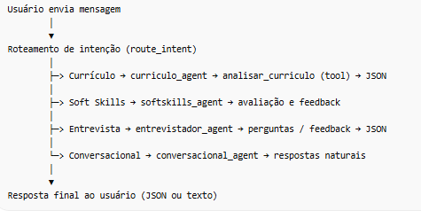

1. Descrição do Problema e da Solução

O sistema é uma plataforma de análise de currículos, avaliação de soft skills e simulação de entrevistas, utilizando Inteligência Artificial Generativa para apoiar usuários em processos de recrutamento e autodesenvolvimento profissional.
* Problema: Usuários precisam de feedback sobre seus currículos, preparação para entrevistas e avaliação de soft skills, sem depender exclusivamente de humanos.

* Solução: O sistema usa LLMs e agentes especializados para:
Analisar currículos e gerar JSON estruturado com score, pontos fortes/fracos e sugestões. Avaliar soft skills com base em descrições do usuário. Simular entrevistas técnicas e comportamentais, gerando perguntas alinhadas à vaga e nível do candidato Manter conversa natural com o usuário em consultas gerais.

2. Arquitetura de LLM 

O fluxo do sistema foi estruturado em agentes especializados e um orquestrador multiagente, como abaixo:

* MultiAgentState: Mantém o estado da interação (inputs, outputs, perguntas, respostas e resultados).

* Orquestrador (StateGraph): Decide qual agente chamar com base na intenção detectada.

*  Agents: Cada agente encapsula regras de prompting e, quando necessário, utiliza ferramentas internas (tools) para análise estruturada

3. Decisões/Parametros/Justificativas

* Modelo LLM: openai/gpt-oss-120b via ChatGroq

    * Justificativa: grande capacidade de compreensão de texto e geração de respostas complexas, adequado para análise de currículos extensos e entrevistas realistas.

    * Temperatura: 0.2 → respostas mais consistentes e menos criativas para análise crítica.
* Ferramenta:
    * analisar_curriculo: vai ser usada para auxiliar o agente e analisar como todo, o curriculo enviado pelo usuario. Permite  tambem gerar JSON estruturado do currículo, separando campos como experiência, formação, habilidades, score e sugestões.
    * estruturar_pergunta: vai ser usada para auxiliar o agente a estruturar as perguntar de acordo com a vaga e nivel de senioridade que o usuario disser.
    * avaliar_resposta_entrevista: vai ser usada para auxiliar o agente a da o feedback criterioso sobre a resposta do usuario

* Orquestração multiagente: Cada intenção do usuário é tratada por um agente especializado, garantindo separação de responsabilidades e modularidade.

* Fallbacks e validações: Conversa natural com conversacional_agent quando o LLM (orquestrador) não pode processar o input. Fallbacks JSON caso o modelo retorne texto não estruturado.

4. O que Funcionou??
* Prompting criterioso para análise de currículos:
    * Uso de regras estritas, penalização de currículos vagos, restrição a JSON → outputs confiáveis.
* Separação de agentes por função:
    * Currículo, soft skills e entrevista independentes → fácil manutenção e tuning.
* Roteamento baseado em intenção:
    * Usuário recebe respostas adequadas sem precisar de instruções complexas.

5. O que Não Funcionou / Limitações
* Limitações do modelo LLM: Em casos de currículos muito extensos (>15k caracteres), truncamento necessário.
* alguns agentes nao foram implementados de forma totalitaria(entrevistador (50%), avaliador de softkill(20%))

Observações Técnicas

* Stack: Python 3.11, Flask, LangChain, LangGraph, APIGroq.

* Sessões seguras: cookies HTTPOnly, configuração dinâmica para produção.

* Frontend: JS/html/css, para chat interativo, upload de PDF e dashboard de análises.

link do diagrama do fluxo: https://lucid.app/lucidchart/e52f52b0-f929-4a59-8291-c5cc606cb014/edit?invitationId=inv_d7bdbb51-c3e5-4139-93d2-02e866f025db&page=0_0#

- Estratégia de prompting 

Técnicas: few-shot + instruções claras + JSON tags → garante formato previsível para frontend e orquestrador.

- Tools / Ferramentas

* estruturar_pergunta → formata pergunta de entrevista em JSON.
* avaliar_resposta_entrevista → gera feedback estruturado para respostas simuladas.
* curriculo_agent: analisa currículo e retorna JSON com campos padronizados (experiência, educação, habilidades).

Por que: facilita parsing automático, mantém consistência e permite expansão futura para mais ferramentas.

- Orquestrador

Serve como mediador para entender a intenção do usuario e assim ativar o agente especializado para a tarefa:
  
    * Currículo → “analise este currículo e retorne JSON”.
    * Soft Skills → “avalie este comportamento / perfil e dê feedback”.
    * Entrevista → “gere perguntas técnicas e comportamentais, retorne JSON”.
    * Conversacional → respostas naturais sem JSON.

Usei prompting estruturado e segmentado por intenção e modo, combinando regras explícitas, contexto do estado do usuário e alguns fallback implementados para garantir saídas confiáveis e consistentes dos agents

Discurso da IA – como usei IA para desenvolver o sistema

Durante o desenvolvimento, utilizei IA generativa (Copilot e ChatGPT) para:

    * Construção da estrutura:

    * Criar a base de roteamento (route_intent) e definição de agentes.

    * Esboçar a integração entre frontend (chat) e backend (Flask + LLM).

Refinamento de prompts:

    * Ajustar o system prompt para garantir JSON correto.

    * Definir modos “conversação” vs “análise”.

Definição  agentes e fluxos especializados:

    * Currículo → análise estruturada

    * Soft Skills → avaliação comportamental

    * Entrevistador → perguntas técnicas/feedback

    * Conversacional → explicações e dicas

Otimização de fluxo multiagente:

    * Identificar quais dados passam entre agentes (MultiAgentState).

    * Garantir que cada agente use apenas as informações relevantes.

Documentação e README:

    * Gerar diagramas UML do fluxo.

    * Estruturar exemplos de output JSON.

    * Explicar decisões de engenharia de LLM de forma clara e justificável.

